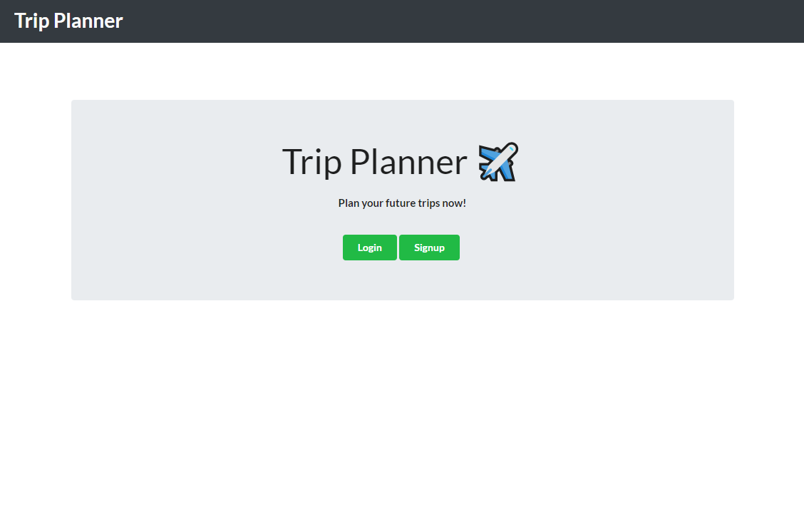
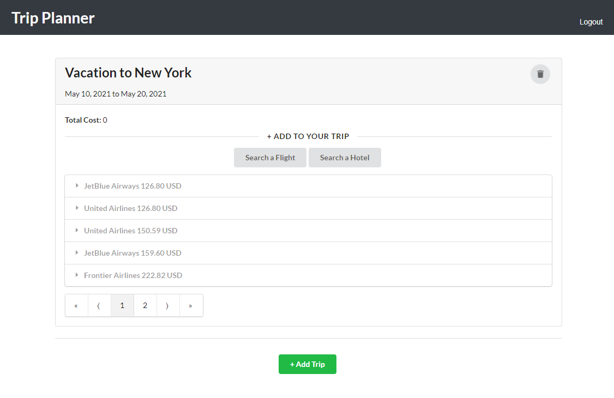

# Trip Planner

Live URL: https://still-taiga-93727.herokuapp.com/ 

# Desciption

This app is a full MERN stack, designed to let users plan ahead of their travels. Once the user created an account, they can then create their own trips with customizable name and description. The user will then be presented with 2 buttons, allowing them to find flights and hotels they can book for their trip.

Due to limited time, some functionality of this website is not yet implemented. This include the function to add selected flight and/or hotels, as well as the ability to remove trips, flights, or hotel. Future implementation will also include the ability to toggle trip to edit mode or save mode, allowing the search buttons to be hidden if not needed.

Initially I thought that this app is small and doesn't require much components. As I was building the website, it kept getting more and more complex than I anticipated. I realized that some aspect of it I could've improved, such as creating global variables. This project give me insights to what it takes to create a React application, helping me more prepared for future projects.

This application is built with MongoDB, Express, React and Node. Its interface is created with the help of Semantic UI and Bootstrap. Aditionally, the app uses a REST API to supply flight and hotel information to the user. The API is avaliable as a npm packet, making API request easier.